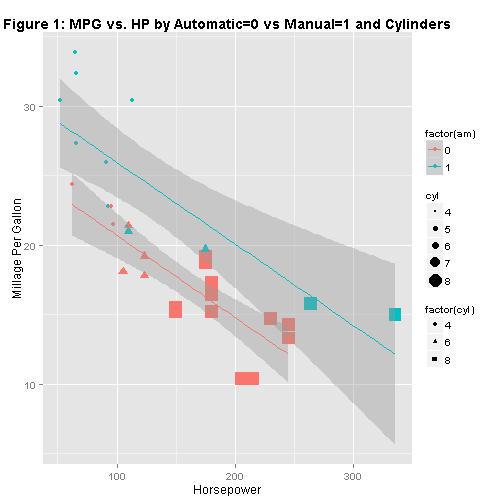
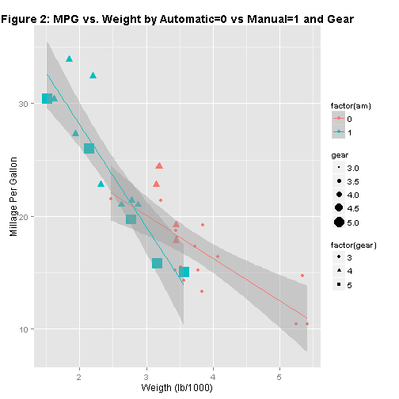
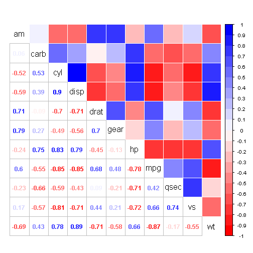
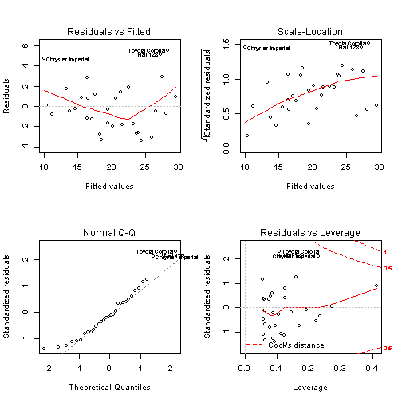
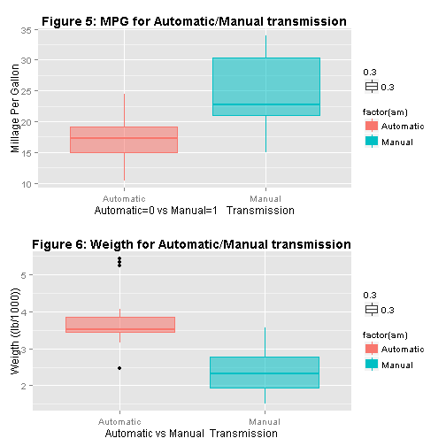

## Executive Summary
We analyzed the miles per gallon of Manual vs. Automatic transmissions. 
We found the answer is yes: Cars with a manual transmission are better for mpg than cars with an automatic transmission.

We notice that there are other reasons that affect as well the mpg, as the weight and the horsepower. 


### Context
You work for Motor Trend magazine. Looking at a data set of a collection of cars, they are interested in exploring the relationship between a set of variables and MPG (outcome). The are particurlarly interested in the questions: 

- "Is an automatic or manual transmission better for MPG"
- "How different is the MPG between automatic manual transmission?"


### Data Set to Analyze
Take the `mtcars` data set, which is from the 1974 Motor Trend US magazine (1973-74 models).
For this purpose the best model is found based on the eliminating the least significant variables from the model and choosing a model with highest adjusted R^2. 
(R^2 is the coefficient of determination, a number that indicates how well data fit a statistical model, the square of the sample correlation coefficient between the outcomes and their predicted values.)

The data set contains thirty-two vehicles, including information about engine volume (disp), horsepower (hp), number of cylinders (cyl), weight (wt), (drat) rear axle ratio, (carb) number of carburetors, and obviously the milage per gallon (mpg) and a binary variable determining whether the vehicle is an automatic or manual transmission (am) (0 = automatic, 1 = manual).

### Step 1: Explore the dataset.


```r
library(datasets)
library(corrplot)
library(knitr)
library(gridExtra)
library(ggplot2)
data(mtcars)
head(mtcars)
```

```
##                    mpg cyl disp  hp drat    wt  qsec vs am gear carb
## Mazda RX4         21.0   6  160 110 3.90 2.620 16.46  0  1    4    4
## Mazda RX4 Wag     21.0   6  160 110 3.90 2.875 17.02  0  1    4    4
## Datsun 710        22.8   4  108  93 3.85 2.320 18.61  1  1    4    1
## Hornet 4 Drive    21.4   6  258 110 3.08 3.215 19.44  1  0    3    1
## Hornet Sportabout 18.7   8  360 175 3.15 3.440 17.02  0  0    3    2
## Valiant           18.1   6  225 105 2.76 3.460 20.22  1  0    3    1
```

Here some Figures that explain the content of the data.

  

#####Note: 
in Figure 2 that in our dataset, automatic cars have lower weight than manual cars.

### Step 2:  Data Transformation
we transform certain variables as a factor: (am, cyl, vs, gear).


```r
mtcars$cyl <- factor(mtcars$cyl)
mtcars$vs <- factor(mtcars$vs)
mtcars$gear <- factor(mtcars$gear)
mtcars$carb <- factor(mtcars$carb)
mtcars$am <- factor(mtcars$am, labels = c("Automatic", "Manual"))
```

A boxplot comparing the miles per gallon (mpg) by transmission type is in Figure 5 at the Appendix. We can clearly see a difference between the two, also show by average mpg:


```r
aggregate(mpg ~ am, data = mtcars, mean)
```

```
##          am   mpg
## 1 Automatic 17.15
## 2    Manual 24.39
```

It looks like the Manual transmissions seem to get better gas mileage, but can we pin point if it is really the transmission type or some other variable?

### Step 3: Exploratory Data Analysis
#### Understanding the Correlations between the variables


```r
col <- colorRampPalette(c("red", "white", "blue"))
set.seed(135)
correlCars<-cor(as.data.frame(mtcars))
```
### Figure 3: Correlation Matrix

```r
corrplot.mixed(correlCars, order = "alphabet",  lower="number", upper="color", tl.cex = 1.3,  tl.col = rgb(0, 0, 0),col = col(20))
```

 

This correlation plot shows the correlation between pairs of the predictors in our dataset. 
we can observe that there is a significant correlation between mpg and the other variables of interest like cyl, disp, hp, draft, wt, vs and am.

In addition and as we mentioned before we are also interested in exploring the relation between the mpg and its effects of car transmission type, (Figure 5).

### Step 4: Regression Analysis
We build different linear regression models based on the variables we preprocessed above and will try to find out the best model and compare it with the base model using anova. 

After model selection, we also perform analysis of residuals.

##### Lets begin with a simple linear model based on transmission type (am) and miles per gallon (mpg):

```r
set.seed(955)
fit <- lm(mpg ~ am,data=mtcars)
summary(fit)
```

```
## 
## Call:
## lm(formula = mpg ~ am, data = mtcars)
## 
## Residuals:
##    Min     1Q Median     3Q    Max 
## -9.392 -3.092 -0.297  3.244  9.508 
## 
## Coefficients:
##             Estimate Std. Error t value Pr(>|t|)    
## (Intercept)    17.15       1.12   15.25  1.1e-15 ***
## amManual        7.24       1.76    4.11  0.00029 ***
## ---
## Signif. codes:  0 '***' 0.001 '**' 0.01 '*' 0.05 '.' 0.1 ' ' 1
## 
## Residual standard error: 4.9 on 30 degrees of freedom
## Multiple R-squared:  0.36,	Adjusted R-squared:  0.338 
## F-statistic: 16.9 on 1 and 30 DF,  p-value: 0.000285
```

Based on the results of this model it appears am transmission types is significant with a p-value < .05, but the R2 implies the model only explains 36% of the variance. 
Now, we will try to do much better. 

##### Now lets try with the complete linear model based on all variables vs miles per gallon (mpg):


```r
fit1 <- lm(mpg ~ .,data=mtcars)
```

Now we still have a p-value < .05 and the R2 explains 89% of the variance.

Now I will run a model with the most correlated variables explosed in Figure 3.


```r
fit2 <- lm(mpg ~ cyl + hp + wt + am ,data=mtcars)
summary(fit2)$coef
```

```
##             Estimate Std. Error t value  Pr(>|t|)
## (Intercept) 33.70832    2.60489 12.9404 7.733e-13
## cyl6        -3.03134    1.40728 -2.1540 4.068e-02
## cyl8        -2.16368    2.28425 -0.9472 3.523e-01
## hp          -0.03211    0.01369 -2.3450 2.693e-02
## wt          -2.49683    0.88559 -2.8194 9.081e-03
## amManual     1.80921    1.39630  1.2957 2.065e-01
```

Looking to the coefficients we see that variables cyl, hp, wt and am are the best predictors of mpg. A Manual transmission vehicle should expect to get 1.8092 better mpg. Each increase of 1000lb of weight (wt) would expect to decrease the mpg experienced by 2.4968 miles. Cars with higher horsepower (hp) and 6 and 8 cylinder vehicles should perform worse than cars with lower horsepower and 4 cylinder vehicles.

Now I will fit 2 more models:


```r
fit3 <- lm(mpg ~  hp + wt + am ,data=mtcars)
summary(fit3)$coef
```

```
##             Estimate Std. Error t value  Pr(>|t|)
## (Intercept) 34.00288   2.642659  12.867 2.824e-13
## hp          -0.03748   0.009605  -3.902 5.464e-04
## wt          -2.87858   0.904971  -3.181 3.574e-03
## amManual     2.08371   1.376420   1.514 1.413e-01
```

```r
fit4 <- lm(mpg ~  hp + wt  ,data=mtcars)
```

We can see that the best (smaller) p-value comes from model fit3.

## Step 5: Model Diagnostics

### Analysis of variances
Using Anova (Analysis of variances) for different models.


```r
anova(fit1, fit2, fit3, fit4)
```

```
## Analysis of Variance Table
## 
## Model 1: mpg ~ cyl + disp + hp + drat + wt + qsec + vs + am + gear + carb
## Model 2: mpg ~ cyl + hp + wt + am
## Model 3: mpg ~ hp + wt + am
## Model 4: mpg ~ hp + wt
##   Res.Df RSS  Df Sum of Sq    F Pr(>F)
## 1     15 120                          
## 2     26 151 -11     -30.6 0.35   0.96
## 3     28 180  -2     -29.3 1.82   0.20
## 4     29 195  -1     -14.8 1.84   0.20
```
Note that the smaller values for the p-value in the anova above indicates that the confounding variables cyl, wt and hp are statistically insignificant; and we reject the hypothesis that these variables do not contribute to the accuracy of our model.


```r
sumCoef<-summary(fit3)$coef
sumCoef[4,1] + c(-1, 1) * qt(.975, df = fit$df) * sumCoef[4, 2]
```

```
## [1] -0.7273  4.8947
```

##### mpg = 34.0028 - 0.03747 * hp -2.87857 * wt + 2.08371 * amManual

### Inference
We will conduct the t-test for mpg as the outcome and am as predictor, we clearly see that the manual and automatic transmissions are significatively different.

```r
t.test(mpg ~ am, data = mtcars)$statistic
```

```
##      t 
## -3.767
```

### Residuals Analysis
We can check diagnostics by examining the Normal QQ plot, the residuals against the fitted values (to check for normality), Scale-Location and Residuals vs. Leverage

### Figure 4


```r
layout(matrix(c(1,2,3,4),2,2))
plot(fit3)
```

 

## Step 6: Conclusions

- Cars with a manual transmission are better for mpg than cars with an automatic transmission.

- There is some relationship between weight and am, and weight may be confounding the consuming of mpg. (See Figure 6).

- With 95% confidence the rate of change of the conditional mean mpg with respect to am is from -0.7273 to  4.8947 mpg. 
mpg increases with respect to having a manual transmission (by 2.08), given the same weight and hp.

## Appendix

### Figures 5 and 6
 

 
